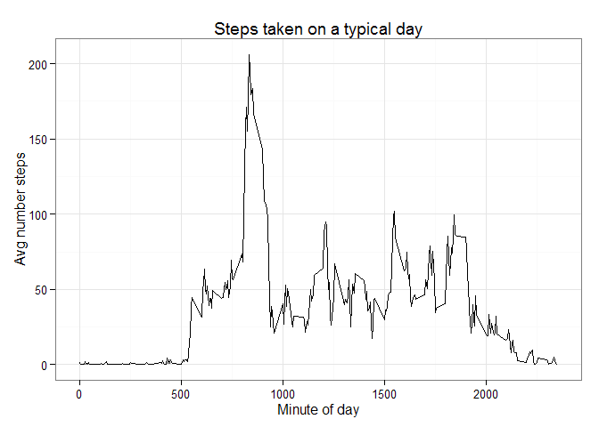

# Reproducible Research - Project 1
Salim Virani  
Sunday, April 10, 2016  


## Loading and Processing data


```r
library(dplyr)
library(ggplot2)
```


```r
act_df <- read.csv("./data/activity.csv", stringsAsFactors=FALSE)
act_df$date  <- as.Date(act_df$date, "%Y-%m-%d")
act_tbl <- arrange(tbl_df(act_df), date, interval)
```


## What is mean total number of steps taken per day?


```r
daily_steps <- act_tbl %>% group_by(date) %>% summarize(steps=sum(steps, na.rm=TRUE))
qplot(steps, data=daily_steps, binwidth=1000) + ggtitle("Distribution of steps per day") + xlab("Steps") + ylab("Number of days") + theme_bw()
```


```r
avg_daily_steps <- round(mean(daily_steps$steps))
median_daily_steps <- median(daily_steps$steps)
```

#### Average steps per day = 9354
#### Median steps per day = 1.0395\times 10^{4}


## What is the average daily activity pattern?

```r
interval_steps <- act_tbl %>% group_by(interval) %>% summarize(steps=mean(steps, na.rm=TRUE))
ggplot(interval_steps, aes(interval, steps)) + geom_line() + ggtitle("Steps taken on a typical day") + xlab("Minute of day") + ylab("Avg number steps") + theme_bw()
```



```r
max_steps <- max(interval_steps$steps, na.rm=TRUE)
max_interval <- interval_steps %>% filter(steps==max_steps)
```


#### Minute interval  with max steps = 835 - 840
#### Max steps during this interval = 206.1698113

## Imputing missing values

```r
nas <- is.na(act_tbl$steps)
total_nas <- sum(nas)
```

#### Total NAs in the dataset = 2304

Imputing missing values by substituting with mean values for that 15 min

```r
act_tbl_imp <- act_tbl
for(i in seq_along(nas)) {
  if (nas[i]) {
    interval_lookup <- interval_steps %>% filter(interval==act_tbl_imp$interval[i])
    act_tbl_imp$steps[i] <- interval_lookup$steps
  }
}
nas_imp <- is.na(act_tbl_imp$steps)
total_nas_imp <- sum(nas_imp)
```
#### Total NAs in the imputed dataset = 0


```r
daily_steps_imp <- act_tbl_imp %>% group_by(date) %>% summarize(steps=sum(steps, na.rm=TRUE))
qplot(steps, data=daily_steps_imp, binwidth=1000) + ggtitle("Distribution of steps per day (data imputed)") + xlab("Steps") + ylab("Number of days") + theme_bw()
```


```r
avg_daily_steps_imp <- round(mean(daily_steps_imp$steps))
median_daily_steps_imp <- median(daily_steps_imp$steps) 
```

#### Average steps per day (data imputed) = 1.0766\times 10^{4}
#### Median steps per day (data imputed) = 1.0766189\times 10^{4}
Average increased  by 1412 and 
Median increased by 371.1886792

## Are there differences in activity patterns between weekdays and weekends?
Following code computes weekday and weekend differences. Chart on left is Weekday and right is Weekend

```r
act_tbl_imp <- act_tbl_imp %>% mutate(isWeekEnd = weekdays(date, abbr=TRUE) %in% c("Sat", "Sun"))
interval_steps_imp <- act_tbl_imp %>% group_by(interval, isWeekEnd) %>% summarize(steps=mean(steps, na.rm=TRUE))
ggplot(interval_steps_imp, aes(interval, steps)) + geom_line() + ggtitle("Steps taken on a typical day by weekday and weekend") + xlab("Minute of day") + ylab("Avg number steps") + theme_bw() + facet_grid(.~isWeekEnd)
```


